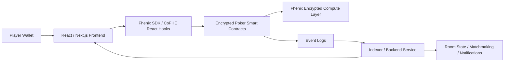

# DarkGame

## Current Production MVP

DarkGame now includes a working CoFHE-powered MVP:

- Solidity contract at `contracts/DarkGame.sol`
- React/Vite frontend in `src/`
- Hardhat deploy script in `scripts/deploy.ts`
- CoFHE unit tests in `test/DarkGame.test.ts`
- Sepolia deployment metadata in `deployments/11155111.json`
- Product roadmap in `docs/ROADMAP.md`

The deployed Sepolia contract is:

```text
0x518159f7B270792fFF3D3a0361C55766c80Dc308
```

The deployed frontend is:

```text
https://darkgame-six.vercel.app
```

Sepolia end-to-end smoke test:

```text
Create table #2: 0x6d2fe29f0d8f0aa8a426d3e020836b90bf84f00cacb1cf7484db99ae18f322b3
Join table #2: 0x82ed3313f4de8c6a00f97b5f0869bfd303e689827daf5d11c981827f6627ea65
Deal encrypted cards: 0x4ecafc4b80348a76679ce6cf10db2a8fad448e3aea2d14bddb3ae92a1b986575
Alice check: 0x0198ab277fd246dd9af6da87db6d3370cd8ccd57be02e6f6f2827f792df287ef
Bob check: 0x229f4c04f15c6c63aec3efc4c10aff9643f592d1514dfb04e753325d0e9e6922
Settle winner: 0x0a4e56e7f06ea087d3df27646f605797d68a4bbfd78bae8f066e1f5606b38508
Withdraw payout: 0x2315b1fdc5dbd2c469cf249e74d11ebdfd1af8f705adda57f38e082245f95b86
Final status: Finished
Final pot: 0 ETH
```

### Verified Flow

The current app supports:

1. Connect an injected wallet.
2. Create a buy-in table.
3. Join a table from a second wallet.
4. Deal contract-owned no-duplicate card handles.
5. Decrypt only your own private hand through the permit flow.
6. Submit actions: check, bet, call, or fold.
7. Compute an encrypted winner on-chain.
8. Reveal only the winner code with `decryptForTx`.
9. Verify the threshold decrypt proof on-chain with `FHE.verifyDecryptResult`.
10. Settle the pot on-chain and withdraw through pull payments.

### Run Locally

```bash
npm install
npm run verify:app
npm run dev
```

For Sepolia, create a local env file using `.env.example` and set:

```bash
VITE_DARKGAME_ADDRESS=0x518159f7B270792fFF3D3a0361C55766c80Dc308
VITE_DEFAULT_CHAIN_ID=11155111
```

### Production Hardening Note

The current build removes the previous player-selected hand path. Cards are now dealt by the contract as no-duplicate encrypted handles, betting is exact-value enforced, stale games can be timed out, and payouts use pull withdrawals. For high-value real-money play, the remaining hardening step is replacing block-entropy dealing with a VRF-backed or FHE-native encrypted shuffle so validators cannot influence card entropy.

DarkGame is the project I am building for the Fhenix Privacy-by-Design Buildathon. It is a privacy-first on-chain game where hidden information stays encrypted during gameplay instead of being exposed on a public blockchain.

The first version of DarkGame is an encrypted 2-player poker game. Each player connects a wallet, joins a table, receives private cards, sees only their own hand, makes moves from the frontend, and lets the smart contract evaluate the result without revealing secret information to everyone else on-chain.

This project exists because blockchain gaming has a serious limitation: blockchains are transparent by default, but many games depend on hidden information. Poker cards, secret roles, private moves, fog-of-war, and sealed decisions cannot work properly if all state is public. DarkGame solves that by using Fully Homomorphic Encryption (FHE) on Fhenix so the game can compute on encrypted data while preserving fairness and privacy.

## What DarkGame Is

DarkGame is a private strategy gaming framework built on encrypted smart contracts. I am starting with poker because it is the clearest and easiest way to demonstrate the value of hidden information on-chain.

In a normal blockchain game:

- game state is public
- hidden cards or roles become visible
- players can inspect the chain and gain unfair information
- the core gameplay loop breaks

In DarkGame:

- cards are encrypted before or when they enter the contract flow
- hidden game state stays encrypted on-chain
- only the correct player can decrypt and view their own private information
- the contract can still enforce rules and compute outcomes
- only the final result needs to be revealed

So the main idea behind DarkGame is simple: I want to make blockchain games playable in categories that were previously impossible because of transparency.

## Why This App Matters

DarkGame is not just a game demo. It shows a bigger point: privacy is not a cosmetic feature in Web3, it is an architectural primitive.

If hidden information cannot stay private, entire categories of applications become unusable:

- poker and card games
- mafia or werewolf style social deduction games
- turn-based strategy games with hidden moves
- fog-of-war multiplayer games
- sealed-bid tournaments or wagering systems

By using Fhenix, I can build a system where the blockchain still guarantees fairness, ownership, and settlement, but it does not expose the exact information that should remain secret during the game.

## Problem Statement

Public chains are excellent for transparency, but they are not naturally designed for games with private state.

Poker is the best example:

- if everyone can inspect everyone else's cards, the game is broken
- if the dealer is centralized and trusted, the game loses its trust-minimized value
- if hidden state is pushed fully off-chain, the on-chain logic becomes weak and hard to verify

So the challenge is not only "how do I build poker on-chain?"

The real challenge is:

How do I build poker on-chain where:

- hidden information remains private
- game logic remains verifiable
- the result remains fair
- the user experience still feels natural

DarkGame is my answer to that problem.

## My Solution

I am using Fhenix FHE to keep gameplay-critical state encrypted while still allowing smart contracts to process game logic.

That means DarkGame can support:

- encrypted card storage
- encrypted comparisons and game logic
- selective decryption for the correct player
- public verification of the result without public exposure of the private state

For the MVP, I am focusing on one very clear promise:

> DarkGame enables a provably fair on-chain poker game where players can keep their cards private while the blockchain still decides the outcome.

## What The App Does

At a product level, the app does the following:

1. A player connects a wallet.
2. The player creates a game room or joins an existing one.
3. Both players lock in the buy-in or entry state.
4. The system deals encrypted cards.
5. Each player decrypts only their own cards on the client side with the proper permit flow.
6. Players take actions such as check, call, bet, raise, or fold.
7. The contract advances the game using encrypted state.
8. The winner is computed and the result is settled on-chain.
9. Only the final outcome is exposed by default, while secret game state remains private.

This creates a game loop that feels familiar to players, but uses privacy-preserving computation underneath.

## How DarkGame Works

### 1. Wallet connection and identity

Each player connects a wallet from the frontend. The wallet acts as the player's identity and signing layer for creating or joining a game.

### 2. Game creation

One player creates a new table. The game contract stores the room metadata, stake amount, participants, round status, and the encrypted game state references.

### 3. Encrypted dealing

The deck and dealt cards are represented in encrypted form. The contract stores encrypted values instead of plain card values.

### 4. Selective card visibility

A player can decrypt only their own cards through the Fhenix permit or decryption flow. The other player cannot access those cards, and spectators cannot inspect them from the chain.

### 5. Player actions

Players submit actions from the frontend. Some actions can remain public if the game design allows it, but the hidden information that drives the round remains encrypted.

### 6. Encrypted game evaluation

The contract processes the round and evaluates the winning hand or final state without exposing the secret cards themselves.

### 7. Settlement

The winner is declared, the game is marked complete, and rewards or pot settlement can happen on-chain.

This is the core value of DarkGame: on-chain enforcement with private game state.

## Best Architecture For DarkGame

The best architecture for this app is a hybrid privacy-first architecture:

- the smart contract layer owns trust-critical game state and settlement
- the Fhenix encryption layer handles encrypted computation and decryption permissions
- the frontend handles wallet interaction, game UI, and user-side decryption
- a lightweight backend supports matchmaking, room discovery, notifications, and indexed reads

I do not want the backend to become a trusted owner of secret game state. The backend should improve speed and UX, but the fairness of the game must still come from the encrypted contract system.

### Why this architecture is the best fit

- It keeps the core game rules trust-minimized.
- It avoids leaking private state through a centralized API.
- It gives me a cleaner user experience than reading every event directly from the chain.
- It is realistic for a hackathon MVP and extensible for a production version later.

## System Architecture



## Architecture Breakdown

### 1. Frontend Layer

The frontend is the player-facing application. It is responsible for:

- wallet connection
- game lobby and room screens
- poker table UI
- player action controls
- displaying only the right player's cards
- calling encrypt, write, and decrypt flows through the SDK

The frontend should feel like a normal multiplayer card game, even though the actual game state is protected by encrypted smart contract logic underneath.

### 2. Smart Contract Layer

The contract layer is the heart of the protocol. It is responsible for:

- game creation and joining
- storing encrypted state
- tracking round progression
- validating player actions
- computing hand logic
- deciding the winner
- settling funds or rewards

This layer should be minimal, strict, and deterministic because it is the source of fairness.

### 3. Encryption and Permission Layer

This is where Fhenix becomes essential.

Instead of storing plain values like:

```solidity
uint8 card = 7;
```

DarkGame uses encrypted values such as:

```solidity
euint8 card;
```

With this model, the system can:

- hold private cards in encrypted form
- run logic on encrypted values
- allow only the right player to decrypt their own data
- reveal the result without revealing the underlying secrets

### 4. Backend and Indexing Layer

The backend is optional for the pure protocol, but it is very useful for the actual app experience.

I plan to use it for:

- matchmaking
- room discovery
- off-chain notifications
- session presence
- indexed event reads for faster UI loading
- analytics and gameplay telemetry

Important design rule: the backend does not need access to decrypted private cards.

### 5. Data Layer

For the application side, I would keep a small and practical data layer:

- PostgreSQL for room metadata, user activity, and history references
- Redis for temporary matchmaking queues and short-lived state
- blockchain event indexing for contract-driven truth

The chain remains the source of truth for trust-sensitive state. The database exists to make the product usable and responsive.

## Recommended Technical Stack

I am designing DarkGame around the following stack:

- Frontend: Next.js, React, TypeScript
- Wallet and chain interaction: viem
- Privacy tooling: Fhenix CoFHE SDK and React hooks
- Smart contracts: Solidity
- Contract development: Hardhat
- Backend: Node.js with Express or NestJS
- Realtime layer: Socket.IO or WebSocket gateway
- Data layer: PostgreSQL and Redis
- Hosting: Vercel for frontend, cloud VM or container platform for backend services

This stack is practical for a buildathon, familiar for Web3 developers, and flexible enough to grow into a production-grade system.

## Smart Contract Architecture

I want the contract system to be modular instead of putting everything into a single large contract.

### Core contract modules

#### 1. GameFactory

Responsible for:

- creating new game rooms
- registering participants
- managing game IDs

#### 2. PokerTable

Responsible for:

- storing game state
- tracking players
- storing encrypted cards
- tracking actions and rounds
- settling the final result

#### 3. HandEvaluator

Responsible for:

- encrypted comparison logic
- hand ranking logic
- deciding the winner

#### 4. Treasury or Pot Manager

Responsible for:

- buy-in handling
- pot accounting
- payout settlement

#### 5. Access and Permit Logic

Responsible for:

- selective decryption permissions
- player-level access control to private state

## Example Game State Model

```solidity
struct Game {
    uint256 gameId;
    address player1;
    address player2;
    euint8[2] player1Cards;
    euint8[2] player2Cards;
    euint8 pot;
    uint8 round;
    bool player1Folded;
    bool player2Folded;
    bool isStarted;
    bool isFinished;
    address winner;
}
```

This model is only a conceptual structure, but it shows the direction clearly: the contract stores game-critical data, and the hidden values remain encrypted.

## Core User Flow

### Create and join flow

1. Player A connects wallet and creates a room.
2. Player B connects wallet and joins the room.
3. Both players lock the required buy-in.
4. The room moves into the active state.

### Gameplay flow

1. The contract initializes the encrypted round state.
2. Each player accesses only their own private cards.
3. Players submit actions in turn.
4. The contract validates each action and advances the round.
5. The contract computes the final outcome.
6. The winner is settled and the room is closed.

## Privacy Model

The privacy model is the most important part of DarkGame.

DarkGame is designed around these principles:

- private game state should never be stored in plaintext on-chain
- only the intended player should be able to view their secret information
- the contract should still be able to enforce game rules
- the final result should be verifiable without exposing all hidden data

This gives DarkGame a strong privacy-by-design foundation, which is exactly what the buildathon is asking teams to explore.

## Trust Model

The trust model I am aiming for is:

- players trust the encrypted smart contract flow for rules and settlement
- players do not need to trust each other
- players should not need to trust the backend with their secret state
- the backend is a UX layer, not the source of truth

This is important because many "private" games become centralized once the hidden game logic moves off-chain. I want DarkGame to avoid that trap.

## Randomness and Fairness

A strong private game also needs strong randomness. For DarkGame, card dealing and shuffle integrity matter just as much as encryption.

For the MVP, I can use a simple controlled design that demonstrates encrypted dealing and fair progression.

For a stronger production architecture, I would combine:

- verifiable randomness for shuffling
- encrypted card assignment
- auditable round transitions
- deterministic settlement logic

That combination is what turns DarkGame from a demo into a truly fair privacy-preserving game system.

## MVP Scope

The MVP is intentionally focused so I can build and demo the core privacy value clearly.

### MVP features

- 2-player encrypted poker game
- wallet connection
- create and join room
- encrypted card handling
- private card viewing for each player
- basic betting actions
- winner computation
- on-chain result settlement

### What I am intentionally not prioritizing in the MVP

- full multi-table tournament system
- advanced poker variants
- complex social features
- large-scale matchmaking
- polished spectator mode

The MVP is about proving the architecture and privacy model first.

## Why This Is A Strong Buildathon Project

DarkGame fits the Fhenix Privacy-by-Design Buildathon extremely well because it demonstrates a category that is naturally blocked on transparent chains.

This project is strong for the program because:

- it uses encrypted state as a core primitive, not as a side feature
- it clearly demonstrates why FHE matters in an actual product
- it is easy to explain in a demo
- it is visual and interactive
- it can evolve into a broader private gaming platform

Most importantly, DarkGame only works properly if privacy is designed into the architecture from day one. That makes it a very natural fit for the buildathon theme.

## Why People Would Use DarkGame

Users would use DarkGame because it offers a combination that traditional systems usually fail to provide all at once:

- fair gameplay
- private information
- on-chain ownership and settlement
- reduced need to trust a centralized operator

For players, this means the game feels competitive and fair.

For builders, this means the architecture can later support many other hidden-information games.

For the ecosystem, this shows that private state is not only useful for finance or governance. It also unlocks new kinds of entertainment and interactive protocol design.

## Future Expansion

Once the poker MVP works well, DarkGame can grow into a broader encrypted gaming platform.

Possible next directions:

- mafia or werewolf with hidden roles
- fog-of-war strategy maps
- private battle decisions
- sealed-bid tournaments
- ranked multiplayer system
- NFT identity, badges, or rewards
- private betting markets and tournament brackets

So while poker is the entry point, the larger vision is encrypted gaming infrastructure.

## Roadmap

### Phase 1 - MVP

- ship encrypted 2-player poker
- complete wallet flow
- complete room flow
- demonstrate private cards and public settlement

### Phase 2 - Better Game Depth

- stronger round logic
- richer action handling
- improved table UX
- match history and replay metadata

### Phase 3 - Platform Expansion

- support multiple private game modes
- introduce ranking and progression
- build reusable encrypted game modules

## Demo Story

The demo flow for judges is simple and strong:

1. Two players connect their wallets.
2. One player creates a room and the other joins.
3. The game starts and cards are dealt in encrypted form.
4. Each player can only view their own hand.
5. Players submit actions.
6. The contract computes the winner.
7. The winner is shown without exposing all hidden information.

That makes the privacy value immediately understandable.

## Final Vision

DarkGame is my attempt to show that privacy-first blockchain applications can be fun, practical, and technically meaningful at the same time.

I am not building this just as a poker demo. I am building it as proof that encrypted state can unlock a new generation of on-chain applications where users do not have to choose between transparency, fairness, and privacy.

That is why DarkGame matters, how it works, and why I believe it is worth building.
